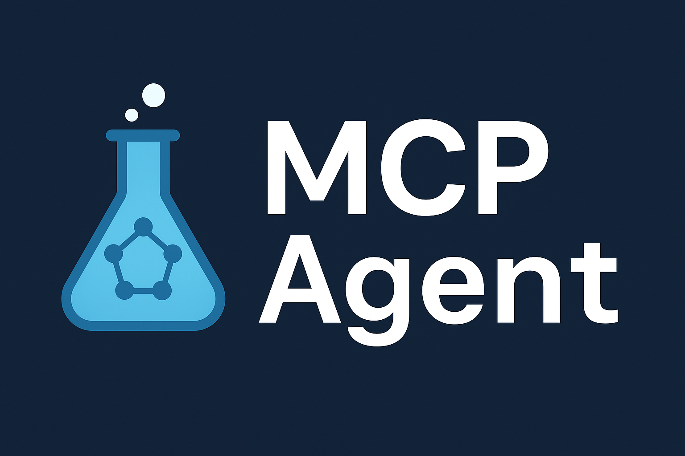

<div align="center">
  <a href="https://github.com/lichman0405/mofmcp">
    
  </a>

  <h1 align="center">🧪 MCP Agent</h1>

  <p align="center">
    A dynamic computational chemistry workflow orchestrator powered by LLMs. Just describe what you want, and let the agent handle the rest.
    <br>
    <a href="README.md">中文</a>
    ·
    <a href="https://github.com/lichman0405/mofmcp/issues">Report Bug</a>
    ·
    <a href="https://github.com/lichman0405/mofmcp/issues">Request Feature</a>
  </p>

<p>
  <a href="https://opensource.org/licenses/MIT"></a>
  <a href="https://www.python.org/"></a>
  <a href="https://fastapi.tiangolo.com/"></a>
  <a href="https://www.docker.com/"></a>
  <a href="https://github.com/lichman0405/mofmcp/issues"></a>
  <a href="https://github.com/lichman0405/mofmcp"></a>
</p>
</div>


## 📖 Overview

**MCP Agent** is an intelligent agent powered by large language models (LLMs). It allows researchers to orchestrate complex computational chemistry workflows—such as geometry optimization or pore analysis—simply by describing their goals in natural language. Its modular, extensible design and robust asynchronous execution make high-level computational tasks accessible to everyone.


## ✨ Key Features

✅ **Natural Language Driven** — No need to write scripts. Just describe your research goal.  
✅ **Dynamic Workflow Orchestration** — LLM plans each step and automatically invokes the appropriate tools.  
✅ **Asynchronous Execution** — Submit tasks and get a task ID immediately; check progress anytime.  
✅ **Modular Toolset** — Easily integrate services like xTB, Zeo++, MACEOPT, and more.  
✅ **Full Traceability** — LLM plans, execution logs, and results are fully recorded for audit and reproducibility.


## 🏗️ Architecture

```
[User Query] 
   ⬇️ 
API Layer (FastAPI)
   ⬇️ 
Planner (LLM Handler)
   ⬇️ 
[Execution Plan (JSON)]
   ⬇️ 
Executor (Agent Executor)
   ⬇️ 
Toolset (xTB, Zeo++, MACEOPT, etc.)
   ⬇️ 
[Results]
```


## 📂 Project Structure

```
mof-screener/
├── app/
│   ├── api/           # API routes
│   ├── core/          # Core logic (planner, executor)
│   ├── schemas/       # Pydantic models
│   ├── services/
│   │   ├── clients/   # Low-level service clients
│   │   └── tools/     # Computational chemistry tool wrappers
│   └── templates/     # Optional templates
├── workspace/         # Stores intermediate files and results
├── Dockerfile         # Docker image
├── docker-compose.yml # Docker Compose launcher
├── requirements.txt   # Python dependencies
└── .env.example       # Environment variable example
```


## 🚀 Getting Started

### 1️⃣ Clone the repository

```bash
git clone https://github.com/lichman0405/mofmcp.git
cd mcp-agent
```

### 2️⃣ Configure environment variables

Copy the example file:

```bash
cp .env.example .env
nano .env
```

Fill in:
- LLM API key
- URLs for computational services (Zeo++, xTB, MACEOPT, etc.)

### 3️⃣ Build and run

Start everything with Docker Compose:

```bash
docker-compose up --build -d
```

The service will listen on `http://localhost:8000` by default.


## 🗂️ API Usage Examples

### ✅ Submit a task

**POST** `/api/v1/agent/execute`  
- `query` (string): Your instruction in natural language  
- `files` (file): One or more structure files

Example:

```bash
curl -X POST "http://localhost:8000/api/v1/agent/execute" -F "query=Use xTB to optimize this structure and analyze its pore size with Zeo++." -F "files=@/path/to/your/mof.cif"
```

Response:

```json
{
  "message": "Agent task accepted and is now running in the background.",
  "task_id": "your-unique-task-id"
}
```

### 🔍 Check task status

**GET** `/api/v1/agent/status/{task_id}`

Example:

```bash
curl "http://localhost:8000/api/v1/agent/status/your-unique-task-id"
```

Response:

```json
{
  "task_id": "your-unique-task-id",
  "status": "completed",
  "llm_plan": { "...LLM generated plan..." },
  "execution_log": { "...Step-by-step execution logs..." },
  "final_results": { "...Final results..." }
}
```


## ⚙️ Requirements

- Python ≥ 3.10
- Docker & Docker Compose
- A valid LLM API key
- Running backend computational services


## 📝 License

This project is released under the **MIT License**.


## 🤝 Contributing

Feel free to contribute via [Issues](https://github.com/lichman0405/mofmcp/issues) and Pull Requests!


## ✨ Acknowledgement

Architecture and inspiration adapted from **MOF-Advisor-API**.

# 🎉 Happy Computing!
