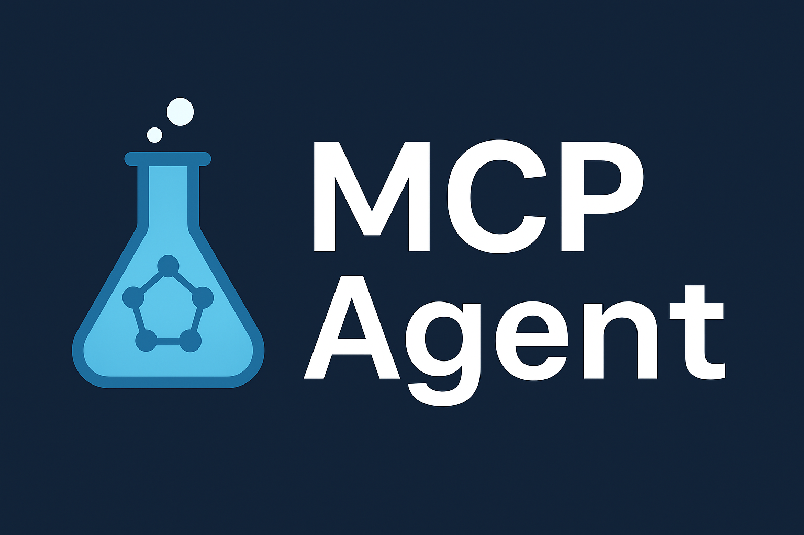

<div align="center">
  <a href="https://github.com/lichman0405/mofmcp">
    
  </a>

  <h1 align="center">🧪 MCP Agent</h1>

  <p align="center">
    由 LLM 驱动的动态计算化学工作流智能编排器，<br>
    让你只需一句话，即可完成复杂的计算化学任务。
    <br>
    <a href="README-en.md">English</a>
    ·
    <a href="https://github.com/lichman0405/mofmcp/issues">报告 Bug</a>
    ·
    <a href="https://github.com/lichman0405/mofmcp/issues">请求新功能</a>
  </p>

<p>
  <a href="https://opensource.org/licenses/MIT"></a>
  <a href="https://www.python.org/"></a>
  <a href="https://fastapi.tiangolo.com/"></a>
  <a href="https://www.docker.com/"></a>
  <a href="https://github.com/lichman0405/mofmcp/issues"></a>
  <a href="https://github.com/lichman0405/mofmcp"></a>
</p>
</div>


## 📖 项目简介

**MCP Agent** 是一个由大型语言模型（LLM）驱动的智能代理，旨在让科研人员用自然语言即可自动编排几何优化、孔径分析等复杂的计算化学工作流。系统以模块化、可扩展、支持长任务的异步执行为核心设计理念，最大程度降低使用门槛。


## ✨ 核心功能

✅ **自然语言驱动** — 无需编写脚本，直接描述科研需求  
✅ **动态工作流编排** — LLM 规划每一步并自动调用合适工具  
✅ **异步执行** — 提交后立刻获取任务 ID，可随时查询状态与结果  
✅ **模块化工具集** — 轻松集成 xTB、Zeo++、MACEOPT 等服务  
✅ **完整可追溯性** — 记录 LLM 规划、执行日志与结果，便于审计与复现


## 🏗️ 架构概览

```
[User Query] 
   ⬇️ 
API Layer (FastAPI)
   ⬇️ 
Planner (LLM Handler)
   ⬇️ 
[Execution Plan (JSON)]
   ⬇️ 
Executor (Agent Executor)
   ⬇️ 
Toolset (xTB, Zeo++, MACEOPT, etc.)
   ⬇️ 
[Results]
```


## 📂 项目结构

```
mof-screener/
├── app/
│   ├── api/           # API 路由
│   ├── core/          # 核心逻辑 (planner, executor)
│   ├── schemas/       # Pydantic 模型
│   ├── services/
│   │   ├── clients/   # 底层服务 API 客户端
│   │   └── tools/     # 计算化学工具封装
│   └── templates/     # 可选模板
├── workspace/         # 存放任务中间文件与结果
├── Dockerfile         # Docker 镜像构建
├── docker-compose.yml # Docker Compose 启动文件
├── requirements.txt   # Python 依赖
└── .env.example       # 环境变量示例
```


## 🚀 快速开始

### 1️⃣ 克隆仓库

```bash
git clone https://github.com/lichman0405/mofmcp.git
cd mcp-agent
```

### 2️⃣ 配置环境变量

复制示例文件：

```bash
cp .env.example .env
nano .env
```

填写：
- LLM API Key
- 计算服务 URL（Zeo++, xTB, MACEOPT 等）


### 3️⃣ 构建并运行

使用 Docker Compose 一键启动：

```bash
docker-compose up --build -d
```

服务启动后，默认监听在 `http://localhost:8000`。


## 🗂️ API 使用示例

### ✅ 提交任务

**POST** `/api/v1/agent/execute`  
- `query` (string): 自然语言指令  
- `files` (file): 一个或多个结构文件

示例：

```bash
curl -X POST "http://localhost:8000/api/v1/agent/execute" -F "query=请用 xTB 优化这个结构，并用 Zeo++ 分析孔径。" -F "files=@/path/to/your/mof.cif"
```

返回：

```json
{
  "message": "Agent task accepted and is now running in the background.",
  "task_id": "your-unique-task-id"
}
```


### 🔍 查询状态

**GET** `/api/v1/agent/status/{task_id}`

示例：

```bash
curl "http://localhost:8000/api/v1/agent/status/your-unique-task-id"
```

返回：

```json
{
  "task_id": "your-unique-task-id",
  "status": "completed",
  "llm_plan": { "...LLM 生成的计划..." },
  "execution_log": { "...每一步的执行记录..." },
  "final_results": { "...最终结果..." }
}
```


## ⚙️ 配置与依赖

- Python ≥ 3.10
- Docker & Docker Compose
- 有效的 LLM API Key
- 运行中的底层计算服务容器


## 📝 License

本项目基于 **MIT License** 开源发布。


## 🤝 贡献

欢迎通过 [Issues](https://github.com/lichman0405/mofmcp/issues) 和 Pull Requests 参与贡献！


## ✨ 致谢

灵感与架构参考自 **MOF-Advisor-API**。


# 🎉 Happy Computing!
